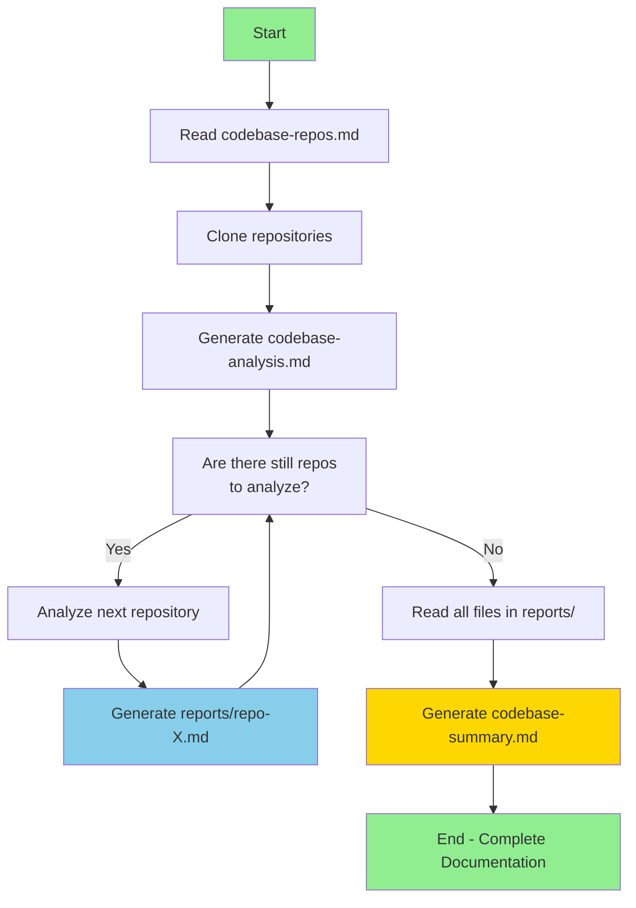
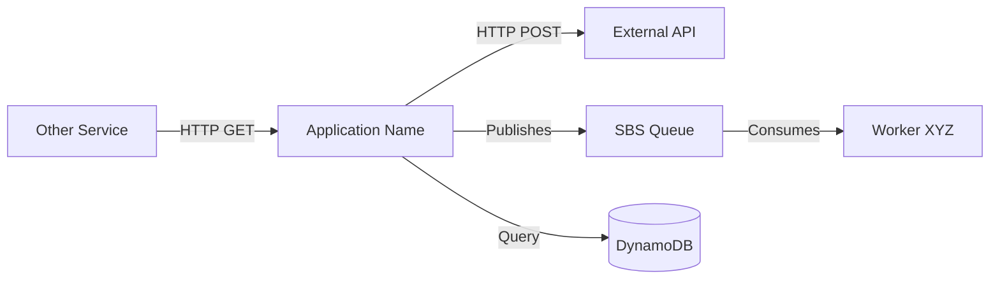
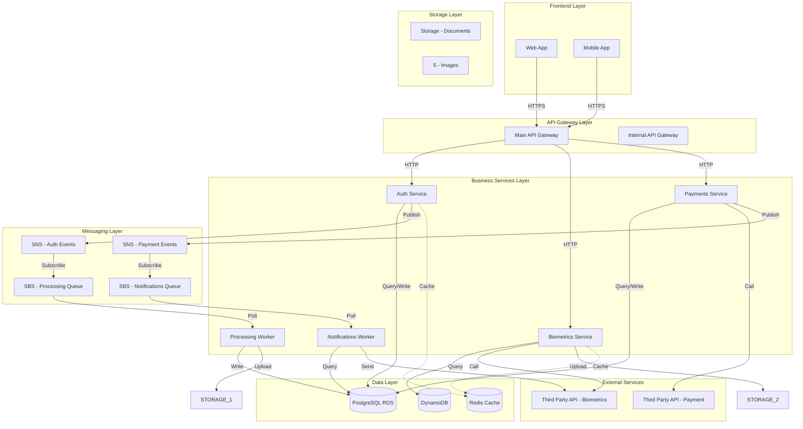
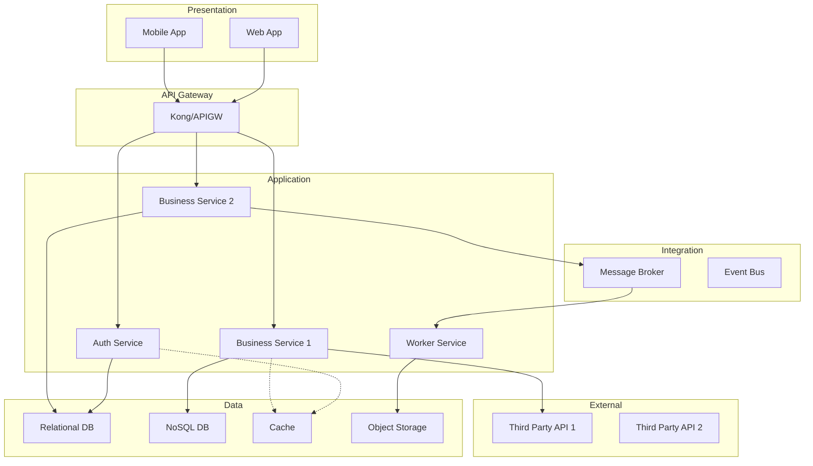

# Code Base Analysis - Multi-Repository
 
## Objective
Analyze all source code repositories of a business solution (BS), generating structured documentation about the understanding of each application, its dependencies, and communications.
 
## Context
This prompt works with multiple repositories that need to be analyzed individually due to context limitations. The analysis is incremental and consolidated into a single assessment document.
 
## Workflow
 

 
### Phase 1: Preparation
1. **Read the `codebase-repos.md` file**
   - This file contains a list of GitHub repository URLs
   - Each line represents a repository of the business solution (BS)
   - Expected format: Full GitHub URLs (e.g., `https://github.com/org/repo-name`)
 
2. **Clone all repositories**
   - For each URL listed in `codebase-repos.md`, execute:
     ```bash
     git clone <repo-url>
     ```
   - Organize the cloned repositories in a dedicated directory (e.g., `repos/`)
 
3. **Generate the `codebase-analysis.md` file**
   - This file will be the work guide for individual analysis
   - Structure it as a task list
   - Each task represents the analysis of ONE specific repository
   - **Important**: Analyze only one repository at a time to avoid context overflow
 
### Phase 2: Individual Analysis (Per Repository)
 
For each repository listed in `codebase-analysis.md`:
 
#### Task: Analyze Repository [REPO-NAME]
 
**Status**: [ ] Pending | [x] Completed
 
**Analysis steps**:
 
1. **Basic Identification**
   - Repository name
   - Main programming language(s)
   - Framework(s) used
   - Application type (API, Worker, Frontend, Library, etc.)
   - Summary of application purpose
 
2. **Dependency Analysis**
   - External services used (OnPrem/GCP/AWS/Azure services/etc.)
   - Databases (DynamoDB, RDS, CosmosDB, etc.)
   - Messaging (SBS, SNS, Service Bus, Kafka, etc.)
   - Storage (S3, Storage accounts, Blob Storage, etc.)
   - Authentication/Authorization (IAM, Managed Identity, etc.)
   - External or internal APIs
   - Other relevant dependencies
 
3. **Communication Analysis**
   - How does the application communicate with other services?
   - Protocols used (HTTP, gRPC, async messaging, etc.)
   - Exposed endpoints (if applicable)
   - Consumed endpoints (if applicable)
 
4. **Configuration Analysis**
   - Environment variables used
   - Relevant configuration files
   - Secrets and sensitive parameters
 
5. **Infrastructure Analysis**
   - Dockerfiles present?
   - Kubernetes/Helm manifests?
   - Deploy/CI-CD scripts?
   - Terraform/Bicep/CloudFormation?
 
6. **Testing Analysis**
   - Test coverage (if available)
   - Test types (unit, integration, e2e)
   - Testing frameworks used
 
7. **Points of Attention**
   - Deprecated or problematic dependencies
   - Legacy code or old patterns
   - Hardcoded configurations
   - Possible multi-cloud migration issues
 
### Phase 3: Individual Documentation
 
After analyzing each repository, **create an individual file** in the `reports/` folder named `[repository-name].md`:
 
#### Structure of `reports/[repository-name].md` file
 
```markdown
# Assessment - [Repository Name]
 
## Identification
 
**Repository Name**: [repository-name]
**Type**: [API/Worker/Frontend/Library/etc]
**Language**: [Main language]
**Frameworks**: [List of frameworks]
**Repository URL**: [GitHub URL]
 
## Summary
[Concise description of the application purpose - 2 to 3 paragraphs explaining what the application does and its role in the business solution]
 
## Service Dependencies
 
### Cloud Services (GCP/AWS/Azure)
- **Service 1**: [Name and purpose]
- **Service 2**: [Name and purpose]
 
### Databases
- **Database 1**: [Type, name and purpose]
- **Database 2**: [Type, name and purpose]
 
### Messaging
- **Service 1**: [Name, type (queue/topic) and purpose]
- **Service 2**: [Name, type (queue/topic) and purpose]
 
### Storage
- **Service 1**: [Name and purpose]
 
### APIs and External Integrations
- **API 1**: [Name, base endpoint and purpose]
- **API 2**: [Name, base endpoint and purpose]
 
### Other Dependencies
- **Dependency 1**: [Name and purpose]
 
## Communication
 
### Exposed Endpoints
| Method | Path | Description | Authentication |
|--------|------|-------------|----------------|
| GET | /api/resource | [Description] | [Type] |
| POST | /api/resource | [Description] | [Type] |
 
### Consumed Endpoints
| Service | Method | Endpoint | Purpose |
|---------|--------|----------|---------|
| [Service Name] | GET | /api/endpoint | [Description] |
 
### Asynchronous Communication
| Type | Name | Action | Purpose |
|------|------|--------|---------|
| Publishes | SBS Queue X | Sends message | [Description] |
| Consumes | SNS Topic Y | Receives event | [Description] |
 
### Communication Diagram
 

 
## Configuration
 
### Environment Variables
| Variable | Description | Example | Required |
|----------|-------------|---------|----------|
| DB_HOST | Database host | localhost | Yes |
| API_KEY | API key | xxx-xxx | Yes |
 
### Configuration Files
- `config/app.json`: [Description]
- `config/database.yml`: [Description]
 
### Secrets and Sensitive Parameters
- [Secret 1]: [How it's managed - SSM, Key Vault, etc]
- [Secret 2]: [How it's managed]
 
## Infrastructure
 
### Containerization
- **Dockerfile**: [Yes/No - path if exists]
- **Base Image**: [Base image name]
- **Exposed Ports**: [List of ports]
 
### Kubernetes/Helm
- **Manifests**: [Yes/No - path if exists]
- **Helm Charts**: [Yes/No - path if exists]
- **Configured Resources**: [Deployments, Services, Ingress, etc]
 
### Infrastructure as Code
- **Terraform**: [Yes/No - path if exists]
- **CloudFormation**: [Yes/No - path if exists]
 
### CI/CD
- **Pipeline**: [GitHub Actions/Azure DevOps/Jenkins/etc]
- **Files**: [Pipeline file paths]
- **Stages**: [Build, Test, Deploy, etc]
 
## Testing
 
### Coverage
- **Percentage**: [X%] (if available)
- **Tool**: [Jest/PyTest/JUnit/etc]
 
### Test Types
- **Unit**: [Yes/No - framework used]
- **Integration**: [Yes/No - framework used]
- **E2E**: [Yes/No - framework used]
 
### Observations
[Comments about the quality/quantity of tests]
 
## Points of Attention for Multi-Cloud Migration
 
### Cloud-Specific Dependencies
- [Dependency 1]: [Impact description and alternative]
- [Dependency 2]: [Impact description and alternative]
 
### Hardcoded Configurations
- [Configuration 1]: [Description and improvement suggestion]
- [Configuration 2]: [Description and improvement suggestion]
 
### Legacy Code or Old Patterns
- [Item 1]: [Description and recommendation]
- [Item 2]: [Description and recommendation]
 
### Specific Recommendations
1. [Recommendation 1]
2. [Recommendation 2]
3. [Recommendation 3]
 
## Additional Observations
[Any relevant information that doesn't fit in the above sections]
 
 
### Phase 4: Consolidation and Overview
 
After analyzing **all repositories**, create the `codebase-summary.md` file in the project root consolidating all information:
 
#### Structure of `codebase-summary.md`
 
```markdown
# Code Base Summary - [BS-NAME] Solution
 
## Solution Overview
 
**Total Repositories Analyzed**: [Number]
**Analysis Date**: [Date]
**Business Purpose**: [General description of the business solution]
 
## Application Summary
 
### [Repository Name 1]
- **Type**: [API/Worker/Frontend/etc]
- **Language**: [Main language]
- **Purpose**: [Summary in 1-2 lines]
- **Main Dependencies**: [Summary list]
- **[Complete details](./reports/repository-name-1.md)**
 
### [Repository Name 2]
- **Type**: [API/Worker/Frontend/etc]
- **Language**: [Main language]
- **Purpose**: [Summary in 1-2 lines]
- **Main Dependencies**: [Summary list]
- **[Complete details](./reports/repository-name-2.md)**
 
[Repeat for all repositories...]
 
## General Solution Architecture
 
### Complete Communication Diagram
 

 
### Layered Diagram
 

 
## Communication Matrix
 
### Inter-Service Communication
 
| Source Service | Target Service | Protocol | Type | Purpose |
|----------------|----------------|----------|------|---------|
| Web App | API Gateway | HTTPS | REST | Authentication |
| API Gateway | Auth Service | HTTP | REST | Token validation |
| Auth Service | PostgreSQL | TCP | Query | Fetch user |
| Business Service | DynamoDB | SDK | NoSQL | Store data |
| Business Service | SBS | SDK | Async | Send event |
| Worker | STORAGE | SDK | Storage | Upload file |
 
### External Dependencies
 
| Internal Service | External Service | Type | Purpose | Criticality |
|------------------|------------------|------|---------|-------------|
| RH Service | Paycheck | Service | Payment processing | High |
| Payment Service | Stripe API | REST API | Payment processing | High |
| Notification Service | SendGrid | REST API | Email sending | Medium |
 
## Shared Dependencies Analysis
 
### Azure Services Used
 
| Service | Type | Repositories Using It | Purpose | Multi-Cloud Alternative |
|---------|------|----------------------|---------|------------------------|
| Cosmos DB | NoSQL Database | repo1, repo3, repo5 | Document storage | Azure Cosmos DB |
| Service Bus | Message Queue | repo2, repo4, repo6 | Async queues | Azure Service Bus Queue |
| Blob Storage | Object Storage | repo1, repo2, repo7 | File storage | Azure Blob Storage |
| Azure SQL Database | Relational DB | repo3, repo4 | Transactional data | Azure Database for PostgreSQL |
| Azure Functions | Serverless Compute | repo8 | Event processing | Azure Functions |
| Event Grid | Pub/Sub | repo2, repo6 | Event notifications | Azure Service Bus Topic |
 
### Identified Architectural Patterns
 
#### 1. API Gateway Pattern
**Repositories**: [repo-api-gateway]
**Description**: Single entry point for all client requests
**Benefits**: Centralized authentication, rate limiting, routing
**Multi-Cloud Considerations**: Requires adaptation for Azure API Management
 
#### 2. Event-Driven Architecture
**Repositories**: [repo-auth, repo-payment, worker-notifications]
**Description**: Asynchronous communication via messaging (SNS/SBS/RabbitMQ/etc.)
**Benefits**: Decoupling, scalability, resilience
**Multi-Cloud Considerations**: Migration SNS→Service Bus Topic, SBS→Service Bus Queue
 
#### 3. CQRS (Command Query Responsibility Segregation)
**Repositories**: [repo-business-service]
**Description**: Separation of read (Cosmos DB) and write (Azure SQL Database)
**Benefits**: Optimized performance, independent scalability
**Multi-Cloud Considerations**: Supported in both clouds
 
#### 4. Worker Pattern
**Repositories**: [worker-processing, worker-notifications]
**Description**: Asynchronous processing via queues
**Benefits**: Background processing, automatic retry
**Multi-Cloud Considerations**: Equivalent pattern in Azure
 
### Technologies and Frameworks Used
 
| Technology | Version | Repositories | Purpose |
|------------|---------|--------------|---------|
| Node.js | 18.x | repo1, repo2, repo5 | Backend runtime |
| Python | 3.11 | repo3, repo4, repo6 | Backend runtime |
| Express.js | 4.x | repo1, repo2 | Web framework |
| FastAPI | 0.104 | repo3, repo4 | Web framework |
| TypeScript | 5.x | repo1, repo5 | Language |
| React | 18.x | repo-frontend | Frontend framework |
| Docker | 20.x | All repos | Containerization |
| Terraform | 1.x | repo-infra | Infrastructure as Code |
| Csharp | 10.x | repo7, repo8 | Backend runtime |
| .NET Core | 6.x | repo7, repo8 | Web framework |
 
## Risk Analysis and Multi-Cloud Recommendations
 
### Identified Risks
 
#### High Impact
1. **Strong dependency on AWS-specific services**
   - **Affected repositories**: repo2, repo4, repo6
   - **Description**: Heavy use of AWS SDK without abstraction
   - **Recommendation**: Implement abstraction layer for cloud services
 
2. **Hardcoded configurations**
   - **Affected repositories**: repo1, repo3
   - **Description**: Fixed endpoints and ARNs in code
   - **Recommendation**: Migrate to environment variables
 
#### Medium Impact
3. **Dependency versioning**
   - **Affected repositories**: repo5, repo7
   - **Description**: Old library versions
   - **Recommendation**: Update dependencies before migration
 
4. **Lack of test coverage**
   - **Affected repositories**: repo6, repo8
   - **Description**: Coverage <50%
   - **Recommendation**: Increase coverage to facilitate migration
 
### Strategic Recommendations for Cloud Migration
 
#### Phase 1: Preparation (Short Term)
1. **Abstract cloud-specific dependencies**
   - Create interfaces for storage, messaging, database services
   - Implement factory pattern to instantiate providers (Azure)
   
2. **Externalize configurations**
   - Migrate all configurations to environment variables
   - Implement Azure Key Vault
 
#### Phase 2: Adaptation (Medium Term)
4. **Implement feature flags**
   - Allow gradual activation of cloud-specific features
 
6. **Implement unified observability**
   - Centralize logs and metrics in Azure Monitor
 
#### Phase 3: Validation (Long Term)
7. **Compatibility testing**
   - Run integration tests in Azure environment
   - Validate performance and costs
 
8. **Documentation and training**
   - Document differences between environments
   - Train team on Azure
 
## Critical Dependencies
 
### Services Requiring High Availability
1. **Auth Service** (repo-auth)
   - Impact: Complete system access blockage
   - Recommended SLA: 99.99%
   
2. **API Gateway** (repo-api-gateway)
   - Impact: All APIs unavailable
   - Recommended SLA: 99.99%
 
3. **Payment Service** (repo-payment)
   - Impact: Unable to process transactions
   - Recommended SLA: 99.95%

## Solution Metrics
 
### Lines of Code
| Repository | Language | LOC | Complexity |
|------------|----------|-----|------------|
| repo1 | TypeScript | 15,000 | Medium |
| repo2 | Python | 8,000 | Low |
| ... | ... | ... | ... |
| **TOTAL** | - | **XX,XXX** | - |
 
### Overall Test Coverage
- **Average Coverage**: X%
- **Repositories with >80%**: X
- **Repositories with <50%**: X
 
## Appendices
- [Details of each repository](./reports/)
- [Detailed architecture diagrams](./diagrams/)
- [Comparative cost spreadsheet](./costs/)
```
```
 
## Execution Instructions
 
### How to use this prompt:
 
1. **First execution - Preparation**:
   - Make sure you have the `codebase-repos.md` file with the repository list
   - Execute: "Clone all repositories listed in codebase-repos.md and generate the codebase-analysis.md file with analysis tasks"
   - Copilot will automatically create the `reports/` folder
 
2. **Incremental analysis - Per repository**:
   - Execute: "Analyze the next pending repository in codebase-analysis.md and create the individual file in reports/[repo-name].md"
   - Repeat until all repositories are analyzed
   - Each analysis will generate a separate markdown file in the `reports/` folder
 
3. **Final consolidation - Overview**:
   - Execute: "Analyze all files in the reports/ folder and generate codebase-summary.md with the complete summary and architecture diagram"
   - Copilot will consolidate all information and create the complete communication diagram between microservices
 
## Limitations and Considerations
 
- **Context**: Analyze only ONE repository at a time to avoid context overflow
- **Individual Files**: Each repository will generate its own file in `reports/[repo-name].md`
- **Incrementality**: Never overwrite existing files, only create new ones or complement
- **Final Consolidation**: The `codebase-summary.md` file should only be generated after ALL repositories are analyzed
- **Diagrams**: Use Mermaid for all visualizations (individual and consolidated)
- **Detail**: Be specific about versions, configurations and dependencies in each individual assessment
- **Multi-cloud**: Identify services that need AWS → Azure adaptation in each repository and consolidate in the summary
- **Organization**: Keep files organized:
  - `reports/` → Detailed individual analyses
  - `codebase-summary.md` → Consolidated and strategic view
  - `codebase-analysis.md` → Task control
 
## Expected Output
 
At the end of the process you will have:
 
### Generated file structure:
```
project/
├── codebase-repos.md                    # Input: Repository list
├── codebase-analysis.md                 # Work guide with tasks
├── codebase-summary.md                  # ✅ Final consolidation with complete diagram
├── reports/                         # ✅ Folder with individual assessments
│   ├── repo-auth-service.md            # ✅ Authentication service assessment
│   ├── repo-payment-service.md         # ✅ Payment service assessment
│   ├── repo-biometrics-worker.md       # ✅ Biometrics worker assessment
│   ├── repo-api-gateway.md             # ✅ API Gateway assessment
│   └── ...                              # ✅ One file for each repository
└── repos/                               # Cloned repositories
    ├── repo-auth-service/
    ├── repo-payment-service/
    └── ...
```
 
### Complete documentation:
1. ✅ **codebase-analysis.md** - Work guide with tasks and status of each analysis
2. ✅ **reports/[repo-name].md** - One detailed file for each repository with:
   - Application identification and summary
   - Complete dependency mapping
   - Individual communication diagrams
   - Configuration and environment variables
   - Infrastructure and testing analysis
   - Points of attention for migration
3. ✅ **codebase-summary.md** - Consolidated view with:
   - Executive summary of all applications
   - Complete architecture diagram (all microservices)
   - Communication matrix between services
   - Shared dependencies analysis
   - Identified architectural patterns
   - Strategic recommendations for multi-cloud migration
4. ✅ All repositories cloned and organized
5. ✅ Mermaid diagrams (individual in each assessment + general in summary)
 
## Practical Usage Example
 
### Scenario: Analysis of "Facial Biometrics" solution
 
**Step 1**: Create `codebase-repos.md`
```
https://github.com/company/auth-service
https://github.com/company/rh-api
https://github.com/company/rh-worker
https://github.com/company/notification-service
```
 
**Step 2**: Execute preparation
```
Prompt: "Clone all repositories listed in codebase-repos.md and generate the codebase-analysis.md file"
```
 
**Step 3**: Incremental analysis (repeat 4 times)
```
Prompt 1: "Analyze auth-service and generate reports/auth-service.md"
Prompt 2: "Analyze rh-api and generate reports/rh-api.md"
Prompt 3: "Analyze rh-worker and generate reports/rh-worker.md"
Prompt 4: "Analyze notification-service and generate reports/notification-service.md"
```
 
**Step 4**: Final consolidation
```
Prompt: "Analyze all files in reports/ and generate codebase-summary.md with complete diagram"
```
 
**Result**: Complete documentation with individual and consolidated view of the architecture!
 
 