# Application Assessment Report

**Generated:** February 18, 2026  
**Application:** PartsUnlimited Website  
**Assessment Type:** Planning & Assessment (Phase 1)  
**Assessed By:** Migration to Azure Agent  

---

## Executive Summary

PartsUnlimited is an ASP.NET MVC 5 e-commerce web application currently targeting **.NET Framework 4.5.1**. The application is a moderately complex monolith featuring a product catalog, shopping cart, order management, admin portal, ASP.NET Identity-based authentication with OAuth external providers, a SignalR real-time hub, a Web API layer, and an Azure ML recommendation engine.

The selected migration path is a **version upgrade only** (.NET Framework 4.5.1 → **.NET 8 LTS**), containerized and deployed to **Azure Kubernetes Service (AKS)**, with **Azure SQL Database** as the managed data store and **Terraform + Helm** for infrastructure and deployment.

No WCF services are present. The primary migration effort centres on replacing `System.Web`-based infrastructure (MVC 5, OWIN, Web API 2, SignalR 2) with ASP.NET Core 8 equivalents, upgrading Entity Framework 6 to EF Core 8, and hardening security by removing secrets from configuration files.

---

## Migration Configuration

| Setting | Value |
|---|---|
| **Modernization Scope** | Version upgrade only (.NET Framework 4.5.1 → .NET 8 LTS) |
| **Target Platform** | Azure Kubernetes Service (AKS) |
| **IaC Tool** | Terraform + Helm |
| **Target Database** | Azure SQL Database |
| **Target Framework** | .NET 8 LTS |
| **Container Runtime** | Docker (Linux containers) |

---

## Current Architecture


---

## Target Azure Architecture

```mermaid
flowchart TD
    Browser([Browser / Client])
    subgraph AKS ["Azure Kubernetes Service (AKS)"]
        Ingress["NGINX Ingress Controller\nTLS Termination"]
        Pod["PartsUnlimited Pod\nASP.NET Core 8\n(.NET 8 LTS Linux container)"]
        AppInsights8["Application Insights SDK\nfor ASP.NET Core"]
    end
    subgraph Azure ["Azure PaaS"]
        SQLDB[("Azure SQL Database\nManaged Identity Auth")]
        KeyVault["Azure Key Vault\nClientSecret · TenantId · ClientId"]
        ACR["Azure Container Registry\nDocker images"]
        EntraID["Microsoft Entra ID\nOIDC · App Roles · MSAL"]
        Monitor["Azure Monitor\nLog Analytics Workspace"]
    end
    subgraph CICD ["CI/CD (GitHub Actions)"]
        Pipeline["Build · Test · Push · Deploy"]
    end

    Browser -->|HTTPS| Ingress --> Pod
    Browser <-->|OIDC redirect| EntraID
    Pod -->|Microsoft.Identity.Web| EntraID
    Pod -->|Managed Identity| SQLDB
    Pod -->|Key Vault SDK| KeyVault
    Pod --> AppInsights8 --> Monitor
    ACR --> AKS
    Pipeline --> ACR
    Pipeline --> AKS
```



---

## Application Analysis

### Technology Stack

| Layer | Current (Legacy) | Target (.NET 8) |
|---|---|---|
| Framework | .NET Framework 4.5.1 | .NET 8 LTS |
| Web Framework | ASP.NET MVC 5.2.3 | ASP.NET Core MVC 8 |
| REST API | Web API 2.2 | ASP.NET Core MVC / Minimal APIs |
| Real-time | SignalR 2.2.1 | ASP.NET Core SignalR |
| Middleware | OWIN 3.0.1 | ASP.NET Core Middleware Pipeline |
| **Auth** | **ASP.NET Identity 2.2.1 + OWIN** | **Microsoft Entra ID + `Microsoft.Identity.Web` (MSAL)** |
| ORM | Entity Framework 6.1.3 | EF Core 8 |
| IoC Container | Unity 4.0.1 | Microsoft.Extensions.DependencyInjection |
| View Engine | Razor (MVC 5) | Razor (ASP.NET Core 8) |
| Bundling | System.Web.Optimization 1.1.3 | LibMan / webpack / built-in static files |
| Telemetry | Application Insights 2.2 | Microsoft.ApplicationInsights.AspNetCore |
| Test Framework | MSTest 1.1.10 + Moq 4.5 | MSTest 3.x / xUnit + Moq 4.20+ |
| Configuration | web.config + appSettings | appsettings.json + environment variables |
| Hosting | IIS | Docker (Linux) → AKS |

### Project Structure

| Project | Type | Framework | Role |
|---|---|---|---|
| `PartsUnlimitedWebsite` | ASP.NET MVC 5 Web App | net451 | Main application |
| `PartsUnlimited.UnitTests` | MSTest | net452 | Unit tests |
| `FabrikamFiber.SeleniumTests` | Selenium UI Tests | net461 | UI integration tests |
| `PartsUnlimitedEnv` | Deployment Project | — | ARM templates (legacy) |

### Controllers & Endpoints

#### MVC Controllers

| Controller | Key Actions | Authentication |
|---|---|---|
| `HomeController` | `Index` — top sellers + new products | Anonymous |
| `AccountController` | Login, Register, External login, 2FA, Password reset | Mixed (AllowAnonymous / Authorize) |
| `ManageController` | Profile, phone, password, linked logins | `[Authorize]` |
| `OrdersController` | `Index(start,end)`, `Details(id)` | `[Authorize]` |
| `CheckoutController` | AddressAndPayment, Complete | `[Authorize]` |
| `SearchController` | `Index(q)` — product search | Anonymous |
| `ShoppingCartController` | View cart, Add, Remove, cart summary | Mixed |
| `StoreController` | Category index, Browse, Product Details | Anonymous |
| `RecommendationsController` | Recommendation display | Anonymous |

#### Admin Area Controllers (Role: Administrator)

| Controller | Key Actions |
|---|---|
| `CustomerController` | Index, Find by username/email/phone |
| `OrdersController` (Admin) | Index, Details |
| `RaincheckController` (Admin) | Raincheck management |
| `StoreManagerController` | CRUD products; triggers `AnnouncementHub` on new product |

#### Web API Controllers

| Controller | Route | Actions |
|---|---|---|
| `ProductsController` | `GET /api/products`, `GET /api/products/{id}?sale=true` | Read-only product data |
| `RaincheckController` | `GET/POST /api/raincheck`, `GET /api/raincheck/{id}` | Raincheck CRUD |

### Dependencies (NuGet Packages)

| Package | Current Version | Migration Target |
|---|---|---|
| EntityFramework | 6.1.3 | `Microsoft.EntityFrameworkCore` 8.x |
| Microsoft.AspNet.Mvc | 5.2.3 | Built into `Microsoft.AspNetCore.App` |
| Microsoft.AspNet.WebApi | 5.2.3 | Built into `Microsoft.AspNetCore.App` |
| Microsoft.AspNet.SignalR | 2.2.1 | `Microsoft.AspNetCore.SignalR` |
| Microsoft.Owin.* | 3.0.1 | **Removed** — ASP.NET Core middleware |
| **Microsoft.AspNet.Identity.*** | **2.2.1** | **Removed** — replaced by `Microsoft.Identity.Web` + Entra ID |
| Unity | 4.0.1 | `Microsoft.Extensions.DependencyInjection` |
| Microsoft.ApplicationInsights.Web | 2.2.0 | `Microsoft.ApplicationInsights.AspNetCore` |
| Newtonsoft.Json | 9.0.1 | `System.Text.Json` (or keep Newtonsoft 13.x) |
| Microsoft.AspNet.Web.Optimization | 1.1.3 | LibMan / static file middleware |
| Moq (test) | 4.5.30 | Moq 4.20.x (compatible with .NET 8) |
| MSTest (test) | 1.1.10-rc2 | MSTest 3.x |
| *(new)* | — | `Microsoft.Identity.Web` 2.x |
| *(new)* | — | `Microsoft.Identity.Web.UI` 2.x |

### Authentication & Authorization

> **Decision (Feb 18, 2026):** Replace ASP.NET Identity with **Microsoft Entra ID** authentication using **`Microsoft.Identity.Web`** (MSAL). No local user store. All identity managed in Entra ID.

| Mechanism | Current | Target |
|---|---|---|
| Cookie / session auth | OWIN Cookie Middleware | `Microsoft.Identity.Web` OIDC cookie (via `AddMicrosoftIdentityWebApp`) |
| Login / logout | Local `AccountController` + OWIN | Entra ID OIDC redirect (`/MicrosoftIdentity/Account/SignIn`) |
| External OAuth providers | OWIN OAuth (Facebook, Google, Twitter, Microsoft) | **Removed** — Entra ID handles federated identity (B2C or social via Entra External ID) |
| Two-factor auth | Phone + Email code via OWIN Identity | **Removed** from app — handled by Entra ID MFA policy |
| User store / local DB | ASP.NET Identity 2 + EF6 (AspNet* tables) | **Removed** — no local user store; identity from Entra ID token claims |
| Password management | Local `ManageController` | **Removed** — password managed in Entra ID / SSPR |
| Role-based auth | `[Authorize(Roles="Administrator")]` | Same attribute — roles sourced from **Entra ID App Roles** |
| Admin role | Seeded in `Startup.Auth.cs` | Entra ID App Role `Administrator` assigned in Azure portal |
| `ManageStore` claim | Custom claim added on login | Entra ID custom claim / app role |
| Secrets | `web.config` appSettings ⚠️ | Azure Key Vault (`ClientSecret`, `TenantId`, `ClientId`) |

### Data Access Patterns

| Item | Detail |
|---|---|
| **DbContext** | `PartsUnlimitedContext : IdentityDbContext<ApplicationUser>` → **`PartsUnlimitedContext : DbContext`** (base class changes; `AspNet*` tables removed) |
| **Entities** | Product, Order, OrderDetail, Category, CartItem, Raincheck, Store, ApplicationUser |
| **Interface** | `IPartsUnlimitedContext` — all DbSets + `SaveChangesAsync`; used throughout controllers |
| **Initializer** | `PartsUnlimitedDbInitializer` — seeds products, categories, orders on first run |
| **Migrations** | EF6 migrations exist; must be re-scaffolded for EF Core 8 |
| **Connection** | SQL Server @ localhost:1433, SQL auth (sa) → Azure SQL + Managed Identity |

### External Integrations

| Integration | Detail | Migration Action |
|---|---|---|
| Azure ML | `AzureMLFrequentlyBoughtTogetherRecommendationEngine` — HTTP call with AccountKey | Move AccountKey to Key Vault; update `HttpClientFactory` pattern |
| Application Insights | SDK 2.2, custom `PartsUnlimitedTelemetryInitializer` | Update to `Microsoft.ApplicationInsights.AspNetCore` |
| OAuth Providers | Facebook, Google, Twitter, Microsoft Account | Re-configure via `builder.Services.AddAuthentication()` |
| SignalR | `AnnouncementHub` — push on new product creation | Migrate to ASP.NET Core SignalR |

---

## Risk Assessment

| # | Area | Risk | Severity | Mitigation |
|---|---|---|---|---|
| 1 | `System.Web.*` dependency | No .NET 8 equivalent — entire HTTP pipeline must be replaced | 🔴 Critical | Convert to ASP.NET Core 8 startup, middleware, controllers |
| 2 | OWIN middleware stack | `Microsoft.Owin.*` not supported on .NET 8 | 🔴 Critical | Replace all OWIN middleware with ASP.NET Core equivalents in `Program.cs` |
| 3 | Admin password in `web.config` | Plaintext secret in source repository | 🔴 Critical | Move to Azure Key Vault; reference via `IConfiguration` |
| 4 | SQL auth connection string | `User Id=sa;Password=...` in config | 🔴 Critical | Use Managed Identity with Azure SQL Database |
| 5 | Entity Framework 6 | Not compatible with .NET 8; breaking API changes in EF Core | 🟠 High | Migrate to EF Core 8; re-scaffold migrations; update LINQ queries |
| 6 | ASP.NET Identity 2 → **Entra ID** | Full replacement: remove local user store, `AccountController`, `ManageController`, `ApplicationUser`, `IdentityDbContext`; `AspNet*` DB tables dropped | 🟠 High | Add `Microsoft.Identity.Web`; configure OIDC in `Program.cs`; create Entra ID App Registration; assign App Roles; update `PartsUnlimitedContext` to inherit `DbContext` directly |
| 7 | Unity IoC container | Unity 4 not compatible with .NET 8 | 🟠 High | Replace `UnityConfig.BuildContainer()` with `builder.Services.*` registrations |
| 8 | `Global.asax` / `Application_Start` | Not supported in .NET 8 | 🟠 High | Move all startup logic to `Program.cs` and middleware pipeline |
| 9 | SignalR 2.2.1 | Client JS library and server Hub API incompatible with ASP.NET Core SignalR | 🟡 Medium | Upgrade server Hub; update client-side JS import; Hub API is similar |
| 10 | ASP.NET MVC 5 → Core MVC | Namespace changes; `System.Web.Mvc` → `Microsoft.AspNetCore.Mvc` | 🟡 Medium | Update `using` statements; most patterns directly compatible |
| 11 | Web API 2 (`ApiController`) | Replace with `ControllerBase`; attribute routing identical | 🟡 Medium | Low effort — update base class and namespaces |
| 12 | `IdentityDbContext` migration | EF6 Identity schema vs EF Core Identity schema differences | 🟡 Medium | Use EF Core Identity; ensure schema compatibility or run migration script |
| 13 | `System.Web.Optimization` bundling | Not available in .NET 8 | 🟡 Medium | Replace with LibMan for CDN references or use webpack for bundling |
| 14 | `HtmlHelperExtensions` | Extension methods on `HtmlHelper<T>` → `IHtmlHelper<T>` | 🟡 Medium | Update method signatures |
| 15 | MSTest 1.1.10-rc2 | Outdated pre-release; upgrade to MSTest 3.x | 🟢 Low | Run `dotnet add package MSTest` |
| 16 | `FabrikamFiber.SeleniumTests` | Selenium project targets .NET Framework 4.6.1 | 🟢 Low | Upgrade or migrate to Playwright/Selenium 4 on .NET 8 |
| 17 | Application Insights SDK | Version 2.2 is outdated; replace with ASP.NET Core SDK | 🟢 Low | Update package; `builder.Services.AddApplicationInsightsTelemetry()` |
| 18 | `Newtonsoft.Json` 9.0.1 | Outdated; optionally replace with `System.Text.Json` | 🟢 Low | Update to 13.x or adopt `System.Text.Json` |
| 19 | ARM templates in `env/` | Legacy ARM templates not needed for Terraform + Helm | 🟢 Low | Archive ARM templates; create Terraform + Helm charts in Phase 3 |

---

## Migration Plan

### Phase 1: Planning & Assessment ✅ Complete
- [x] Gather user requirements
- [x] Analyse codebase structure, dependencies, and auth
- [x] Identify risks and breaking changes
- [x] Generate assessment report and status file

### Phase 2: Code Modernization (Next)

**Step 1 — Create new SDK-style project**
- Replace `.csproj` with SDK-style `<Project Sdk="Microsoft.NET.Sdk.Web">`
- Target `net8.0`
- Remove `packages.config`; add `<PackageReference>` items

**Step 2 — Replace startup pipeline**
- Delete `Global.asax` and `Startup.cs` (OWIN)
- Create `Program.cs` with `WebApplication.CreateBuilder()`
- Move all `Application_Start` logic into `Program.cs` / `Startup` middleware

**Step 3 — Migrate OWIN → ASP.NET Core middleware + Entra ID auth**
- Remove all `Microsoft.Owin.*` and `Microsoft.AspNet.Identity.*` packages
- Add `Microsoft.Identity.Web` and `Microsoft.Identity.Web.UI` packages
- Configure Entra ID OIDC in `Program.cs`:
  ```csharp
  builder.Services.AddAuthentication(OpenIdConnectDefaults.AuthenticationScheme)
      .AddMicrosoftIdentityWebApp(builder.Configuration.GetSection("AzureAd"));
  builder.Services.AddAuthorization(options =>
  {
      options.FallbackPolicy = options.DefaultPolicy;
  });
  ```
- Add `AzureAd` section to `appsettings.json` (secrets in Key Vault):
  ```json
  "AzureAd": {
    "Instance": "https://login.microsoftonline.com/",
    "Domain": "<your-tenant>.onmicrosoft.com",
    "TenantId": "<tenant-id>",
    "ClientId": "<client-id>",
    "CallbackPath": "/signin-oidc",
    "ClientSecret": "<from-key-vault>"
  }
  ```
- Map sign-in / sign-out routes via `app.MapControllerRoute` + `Microsoft.Identity.Web.UI` Razor pages:
  ```csharp
  app.MapRazorPages(); // provides /MicrosoftIdentity/Account/SignIn, SignOut
  ```
- SignalR → `builder.Services.AddSignalR()` + `app.MapHub<AnnouncementHub>("/hubs/announcement")`

**Step 4 — Remove ASP.NET Identity; replace with Entra ID identity**
- **Delete** `AccountController.cs` (local login/register/password reset replaced by Entra ID portal)
- **Delete** `ManageController.cs` (phone, password, 2FA managed in Entra ID)
- **Delete** `Models/ApplicationUser.cs` and all `AccountViewModels` / `ManageViewModels`
- **Delete** `App_Start/IdentityConfig.cs` (EmailService, SmsService stubs)
- **Update** `PartsUnlimitedContext` to inherit from `DbContext` (not `IdentityDbContext<ApplicationUser>`) — removes `AspNet*` tables
- Re-scaffold EF migrations after context base class change
- **Configure App Roles in Entra ID** (Azure portal → App Registration → App roles):
  - Role: `Administrator` (maps to `[Authorize(Roles="Administrator")]`)
  - Role: `ManageStore` (replaces `AdminConstants.ManageStore` claim)
- **Update admin authorization** in `AdminController` — `[Authorize(Roles="Administrator")]` remains unchanged; roles now come from the Entra ID token
- Update `_Layout.cshtml` login/logout links to use `MicrosoftIdentityWebChallengeUserNoLoginHint` / `/MicrosoftIdentity/Account/SignOut`
- Update views that reference `User.Identity.GetUserId()` → use `User.FindFirstValue(ClaimTypes.NameIdentifier)` or `ClaimTypes.ObjectIdentifier`

**Step 5 — Migrate IoC container**
- Replace `UnityConfig.BuildContainer()` with `builder.Services.AddScoped/Transient/Singleton()` registrations
- Remove Unity, Unity.Mvc4, Unity.WebAPI packages

**Step 6 — Upgrade to EF Core 8**
- Swap `EntityFramework` → `Microsoft.EntityFrameworkCore.SqlServer`
- Update `PartsUnlimitedContext` (remove `IDbSet<T>` → use `DbSet<T>`; base class is now `DbContext`)
- Update `IPartsUnlimitedContext` interface
- Re-scaffold EF migrations (`dotnet ef migrations add InitialCreate`)
- Update LINQ queries for EF Core compatibility

**Step 7 — Update MVC controllers and Razor views**
- Replace `using System.Web.Mvc` → `using Microsoft.AspNetCore.Mvc`
- Update `ActionResult` returns; add `Task<IActionResult>` where async
- Update `ValidateAntiForgeryToken`, `HttpGet`, `HttpPost` attributes (compatible)
- Update `HtmlHelper` extension methods

**Step 8 — Update Web API controllers**
- Replace `ApiController` → `ControllerBase`
- Update `using System.Web.Http` → `using Microsoft.AspNetCore.Mvc`
- Verify attribute routing

**Step 9 — Migrate configuration**
- Convert `web.config` appSettings → `appsettings.json`
- Convert connection string; prepare for Managed Identity (remove User Id/Password)
- Register Azure Key Vault as configuration provider

**Step 10 — Update Application Insights and telemetry**
- Swap to `Microsoft.ApplicationInsights.AspNetCore`
- Register via `builder.Services.AddApplicationInsightsTelemetry()`
- Update `PartsUnlimitedTelemetryInitializer`

**Step 11 — Static assets / bundling**
- Remove `System.Web.Optimization` bundle config
- Serve static files via `app.UseStaticFiles()`
- Use LibMan or retain pre-bundled files

**Step 12 — Update tests**
- Upgrade test projects to `net8.0`
- Update MSTest to 3.x
- Update Moq to 4.20.x
- Verify and update mock setup patterns

**Step 13 — Add Dockerfile**
- Multi-stage Dockerfile (`sdk:8.0` build → `aspnet:8.0` runtime)
- Non-root user; health check; expose port 8080

### Phase 3: Infrastructure Generation
- Terraform modules: AKS cluster, Azure SQL Database, Azure Container Registry, Azure Key Vault, Log Analytics, Managed Identity
- Helm chart: Deployment, Service, Ingress, ConfigMap, HorizontalPodAutoscaler
- Workload Identity federation for Managed Identity → Azure SQL

### Phase 4: Deployment to Azure
- Push Docker image to ACR
- `helm upgrade --install` to AKS
- EF Core migrations run as Kubernetes Job or startup check
- Health check validation

### Phase 5: CI/CD Pipeline Setup
- GitHub Actions workflow: build → test → docker build/push → helm deploy
- Environment-specific value files (dev, staging, prod)
- Secret scanning gate; minimum test coverage gate

---

## Effort Estimation

| Phase | Estimated Effort | Notes |
|---|---|---|
| Phase 2 — Code Modernization | 5–8 days | Startup pipeline + EF Core migration are largest items |
| Phase 3 — Infrastructure (Terraform + Helm) | 2–3 days | AKS + SQL + Key Vault Terraform + Helm chart |
| Phase 4 — Deployment | 1–2 days | First deployment + smoke testing |
| Phase 5 — CI/CD | 1–2 days | GitHub Actions pipeline |
| **Total** | **9–15 days** | Assuming 1 developer |

---

## Cost Estimation (T-Shirt Sizing)

| Size | Criteria | Est. Monthly Cost |
|---|---|---|
| S | Single web app, <100 users, basic DB | $50–150/month |
| **M** | Web app + API, 100–500 users, standard DB | **$150–500/month** |
| L | Multiple services, 500–2000 users | $500–1500/month |
| XL | Microservices, 2000+ users, HA/DR | $1500+/month |

**Recommended Size: M**

| Azure Resource | SKU Estimate | Est. Monthly Cost |
|---|---|---|
| AKS Cluster (2× Standard_D2s_v3 nodes) | Standard | ~$140 |
| Azure SQL Database | General Purpose 2 vCores | ~$185 |
| Azure Container Registry | Basic | ~$5 |
| Azure Key Vault | Standard | ~$5 |
| Log Analytics Workspace | Pay-per-GB | ~$10–30 |
| Application Insights | Included (5 GB free/month) | ~$0–15 |
| **Estimated Total** | | **~$345–380/month** |

> For precise estimates, use the [Azure Pricing Calculator](https://azure.microsoft.com/pricing/calculator/).

**Cost Optimization Tips:**
- Use AKS Spot node pools for non-production environments
- Enable SQL Database serverless tier for dev/test
- Use ACR Basic tier; upgrade to Standard only if geo-replication needed
- Configure AKS cluster autoscaler to scale down during off-peak hours

---

## Change Report

| # | File / Area | Change Required | Approach | Docs | Verification |
|---|---|---|---|---|---|
| 1 | `PartsUnlimitedWebsite.csproj` | Convert to SDK-style project; set `TargetFramework=net8.0`; replace `packages.config` with `<PackageReference>` | Rewrite project file | [SDK-style projects](https://learn.microsoft.com/en-us/dotnet/core/project-sdk/overview) | `dotnet build` succeeds |
| 2 | `Global.asax` / `Global.asax.cs` | Remove; migrate startup logic to `Program.cs` | Delete file; create `Program.cs` | [App startup in ASP.NET Core](https://learn.microsoft.com/en-us/aspnet/core/fundamentals/startup) | App starts; routes resolve |
| 3 | `Startup.cs` + `App_Start/Startup.Auth.cs` | Remove OWIN startup; replace with ASP.NET Core middleware in `Program.cs` | Rewrite | [Auth middleware](https://learn.microsoft.com/en-us/aspnet/core/security/authentication/) | Login/logout works; cookies set |
| 4 | `App_Start/UnityConfig.cs` | Remove Unity; replace all registrations with `builder.Services.*` | Rewrite | [DI in ASP.NET Core](https://learn.microsoft.com/en-us/aspnet/core/fundamentals/dependency-injection) | App starts; controllers resolve |
| 5 | `Models/PartsUnlimitedContext.cs` | EF6 → EF Core 8; update `IDbSet<T>` to `DbSet<T>`; update `IdentityDbContext` base | Update file | [EF Core migration guide](https://learn.microsoft.com/en-us/ef/core/get-started/) | `dotnet ef migrations add` succeeds |
| 6 | `Migrations/` folder | Delete EF6 migrations; re-scaffold for EF Core | Delete + `dotnet ef migrations add InitialCreate` | [EF Core migrations](https://learn.microsoft.com/en-us/ef/core/managing-schemas/migrations/) | DB schema created correctly |
| 7 | All controllers (`using System.Web.Mvc`) | Update namespace to `Microsoft.AspNetCore.Mvc`; update return types | Find & replace namespaces; review each class | [Controller migration](https://learn.microsoft.com/en-us/aspnet/core/migration/mvc) | `dotnet build` succeeds; GET requests return 200 |
| 8 | `Api/ProductsController.cs`, `Api/RaincheckController.cs` | `ApiController` → `ControllerBase`; update `System.Web.Http` → `Microsoft.AspNetCore.Mvc` | Update base class and namespaces | [Web API migration](https://learn.microsoft.com/en-us/aspnet/core/migration/webapi) | API endpoints return correct data |
| 9 | `Hubs/AnnouncementHub.cs` | Migrate from SignalR 2 to ASP.NET Core SignalR; remove `GlobalHost` usage | Update Hub; update server push in `StoreManagerController` | [SignalR migration](https://learn.microsoft.com/en-us/aspnet/core/signalr/introduction) | Real-time push works in browser |
| 10 | `Scripts/NewStoreArrivals.js` | Update SignalR client JS import and connection API | Update `$.connection` to `@microsoft/signalr` HubConnection | [SignalR JS client](https://learn.microsoft.com/en-us/aspnet/core/signalr/javascript-client) | New product announcement displays |
| 11 | `web.config` | Convert to `appsettings.json`; remove assembly binding redirects | New file; reference Key Vault for secrets | [Config migration](https://learn.microsoft.com/en-us/aspnet/core/migration/configuration) | `IConfiguration` resolves all settings |
| 12 | `App_Start/BundleConfig.cs` | Remove `System.Web.Optimization`; use static files middleware | Delete file; update `_Layout.cshtml` CDN links or use LibMan | [Static files](https://learn.microsoft.com/en-us/aspnet/core/fundamentals/static-files) | CSS/JS loads correctly |
| 13 | `Utils/HtmlHelperExtensions.cs` | Update extension method signatures (`HtmlHelper<T>` → `IHtmlHelper<T>`) | Update method signatures | [Tag helpers](https://learn.microsoft.com/en-us/aspnet/core/mvc/views/tag-helpers/intro) | Views render without errors |
| 14 | `Utils/PartsUnlimitedDbInitializer.cs` | EF6 `IDatabaseInitializer` → EF Core seeding via `HasData()` or `IHostedService` | Rewrite seeding logic | [EF Core seeding](https://learn.microsoft.com/en-us/ef/core/modeling/data-seeding) | DB seeded on first run |
| 15 | `Utils/SignalRDependencyResolver.cs` | Remove Unity-SignalR bridge; not needed in ASP.NET Core SignalR | Delete file | — | No compile errors |
| 16 | `App_Start/IdentityConfig.cs` | **Delete** — `EmailService`/`SmsService` stubs no longer needed; email/SMS handled by Entra ID (MFA, SSPR) | Remove file | — | No compile errors |
| 17 | Admin seeding in `Startup.Auth.cs` (`CreateAdminUser`) | **Delete** — admin user and `Administrator` role are managed in Entra ID portal (App Roles), not seeded in code | Remove `CreateAdminUser()` and `RoleManager` seeding logic | [Entra ID App Roles](https://learn.microsoft.com/en-us/azure/active-directory/develop/howto-add-app-roles-in-apps) | Admin role assignment works; `[Authorize(Roles="Administrator")]` resolves from token |
| 18 | Connection string | Remove SQL auth credentials; use Managed Identity | `Server=...;Database=...;Authentication=Active Directory Default;` | [Managed Identity SQL](https://learn.microsoft.com/en-us/azure/azure-sql/database/authentication-aad-overview) | App connects to Azure SQL with no stored credentials |
| 19 | Admin password & OAuth secrets | Remove from `web.config`/`appsettings.json`; store in Azure Key Vault | Key Vault reference in configuration | [Key Vault configuration](https://learn.microsoft.com/en-us/azure/app-service/app-service-key-vault-references) | Secrets loaded at runtime from Key Vault |
| 20 | `ApplicationInsights.config` | Remove XML config; configure programmatically | Delete file; `builder.Services.AddApplicationInsightsTelemetry()` | [AppInsights for ASP.NET Core](https://learn.microsoft.com/en-us/azure/azure-monitor/app/asp-net-core) | Telemetry flows to Azure Monitor |
| 21 | Test projects | Upgrade to `net8.0`; update MSTest to 3.x | Update `.csproj` target framework and package versions | — | `dotnet test` passes |
| 22 | Add `Dockerfile` | Multi-stage Docker build for AKS deployment | New file | [Containerize .NET](https://learn.microsoft.com/en-us/dotnet/core/docker/build-container) | `docker build` succeeds; container starts healthy |

---

## Next Steps

1. ✅ Phase 1 complete — assessment report and status file created
2. ➡️ **Proceed to Phase 2:** Run `/phase2-migratecode` to begin code modernization
3. After code modernization, run `/phase3-generateinfra` for Terraform + Helm chart generation
4. Deploy with `/phase4-deploytoazure`
5. Set up CI/CD with `/phase5-setupcicd`

> **Security Actions (Do Immediately):**
> - Do not commit `web.config` with the plaintext admin password or connection string credentials to any remote repository until they are removed.
> - Rotate the sa password and OAuth secrets before any production deployment.
